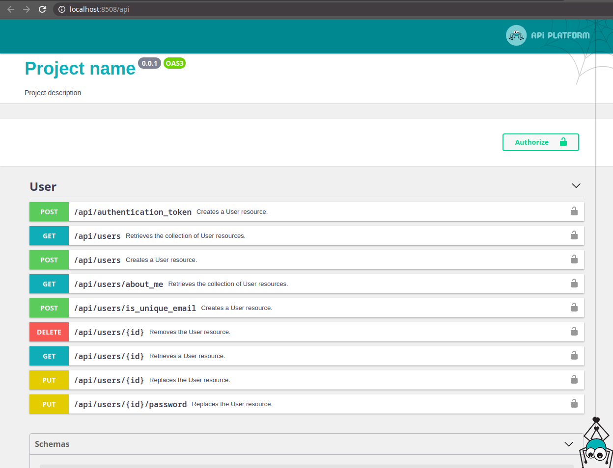

# Api Starter Kit

Starter kit for API with 
[Symfony](https://symfony.com/), 
[Doctrine](https://www.doctrine-project.org/), 
[Maker Bundle](https://symfony.com/doc/current/bundles/SymfonyMakerBundle/index.html), 
[Migrations Bundle](https://symfony.com/doc/current/bundles/DoctrineMigrationsBundle/index.html), 
[Api-Platform](https://api-platform.com/) and 
[JWT-auth](https://jwt.io/). 

Kit has also already created User entity with all crud routes

Kit has 3 docker containers: **php, nginx** and **mysql** 



## Installation

Download the project<br>
```composer create-project kadirov/api-starter-kit --ignore-platform-reqs --no-scripts```

Go to the project directory<br>
```cd api-starter-kit```

Run docker containers <br>
```docker-compose up -d```

Enter to php container <br>
```docker-compose exec php bash```

Install requirements via composer <br>
```composer install```

*if you got error like "An exception occurred in driver: SQLSTATE[HY000] [2002] Connection refused"  - don't mind. 
Some times mysql server needs more time to do first settings. 
Just run ```composer install``` again after few minutes.*  

For use JWT you must to create private and public keys first.

Get passphrase from .env files<br>
```jwt_passphrase=${JWT_PASSPHRASE:-$(grep ''^JWT_PASSPHRASE='' .env | cut -f 2 -d ''='')}```

Create private key<br>
```echo "$jwt_passphrase" | openssl genpkey -out config/jwt/private.pem -pass stdin -aes256 -algorithm rsa -pkeyopt rsa_keygen_bits:4096```

Create public key<br>
```echo "$jwt_passphrase" | openssl pkey -in config/jwt/private.pem -passin stdin -out config/jwt/public.pem -pubout```

Allow read action for www-data user<br>
```chmod 0644 config/jwt/private.pem```

Run migrations<br>
```bin/console  doctrine:migrations:migrate```

Type ```exit``` for exiting php container or press ```CTRL + D```

**Done! You can open ```http://localhost:8507/api``` via browser. By the way, you can change this port by changing ```DOCKER_NGINX_PORT``` variable in [.env](.env) file.** 


## Docker

For enter to php container run 
```docker-compose exec php bash```

For enter to mysql container run 
```docker-compose exec mysql bash```

For enter to nginx container run 
```docker-compose exec nginx bash```


You can change containers prefix by chnaging ```DOCKER_PROJECT_NAME``` variable in [.env](.env) file.  

Also, you can change public ports of nginx and mysql by changing ```DOCKER_NGINX_PORT``` and ```DOCKER_DATABASE_PORT```

Database allows connections only from localhost. Because of this you should connect to server via ssh bridge if you use this project for production.


## Cron

You can use [docker/php/cron-file](docker/php/cron-file) for cron jobs. But after you must to re-build php container by 

```docker-compose up -d --build```

## Swagger 
You can change project name and description on swagger by editing file
[config/packages/api_platform.yaml](config/packages/api_platform.yaml)

## Git Hook

If you don't use any deploying system you can do <br>
```cp docker/other-files/git/hooks/post-merge .git/hooks``` 

In this way git always executes command ```bin/console my:deploy```. You can change this command in the file [src/Command/MyDeployCommand.php](src/Command/MyDeployCommand.php).
This command will clear caches, change owner of ./var and ./public/media folders to www-data, will run migrations. 
